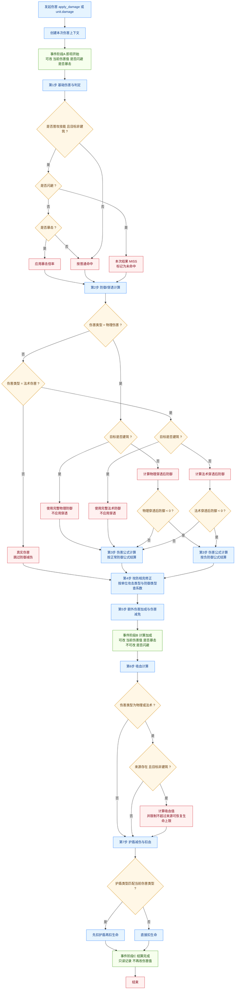

# Y3 伤害类型与伤害计算系统

游戏伤害系统包含**伤害类型**和**攻防相克系统**两个独立维度。

## 伤害类型 (DamageType)

游戏中定义的伤害类型如下：

| 类型 | 值 | 说明 | 状态 |
|------|---|------|------|
| `physical` | 0 | 物理伤害 - 受目标**物理防御**影响 | 已实现 |
| `magic` | 1 | 法术伤害 - 受目标**法术防御**影响 | 已实现 |
| `real` | 2 | 真实伤害 - **无视物理/法术防御** | 已实现 |
| `adaptive` | 3 | 自适应伤害（根据目标防御自动选择） | 未实现 |

> **adaptive** (值3) 在编辑器常量里有定义，但运行时只正式支持 0/1/2。
> - `damage_type` 可以传任意整数（会透传到伤害流程）
> - 只有 `0/1/2` 是官方支持类型
> - `3` 或其他值不属于官方伤害类型流程；若要用，只能在伤害事件里自行模拟伤害结算流程

---

## 完整伤害计算流程

伤害计算分为以下步骤：

### 第0步：基础判断

- 伤害来源可能为空（如非攻击伤害）
- `damage()` 传入的是本次伤害数值（按伤害流程结算）
- 治疗走独立治疗流程（对应受到治疗相关事件）

### 第1步：计算基础伤害 + 伤害判定

> 由引擎内部处理，Lua通过damage()方法触发

- **闪避判定**：`命中率 - 闪避率` 决定是否命中
  - 仅对普攻（is_attack=true）判定
  - 建筑单位无法闪避
  
- **暴击判定**：仅对普攻且目标单位非建筑判定
  - 触发概率：`暴击率 × 1%`
  - 伤害倍率：`基础伤害 × 暴击伤害 × 1%`

- **结果状态**：HIT、MISS、CRITICAL、IMMUNITY 等

```
基础伤害 = 技能配置伤害值 × 暴击系数
```

### 第2步：防御减伤 (仅物理和法术伤害)

根据伤害类型选择对应防御：

```
// 物理伤害
if (伤害类型 == physical):
    防御值 = 目标单位.物理防御 (defense_phy)
    穿透值 = 来源单位.物理穿透 (pene_phy)
    穿透率 = 来源单位.物理穿透率 (pene_phy_ratio)
    
// 法术伤害
elif (伤害类型 == magic):
  防御值 = 目标单位.法术防御 (defense_mag)
  穿透值 = 来源单位.法术穿透 (pene_mag)
  穿透率 = 来源单位.法术穿透率 (pene_mag_ratio)

// 真实伤害 - 跳过此步骤
```

**有效防御计算**：
```
有效防御 = (防御值 - 穿透值) × (1 - 穿透率 × 1%)

// 注意：穿透对建筑无效（建筑永远使用完整防御值）
```

**最终伤害**：根据有效防御值计算，由引擎自动处理

### 第3步：攻防相克矩阵修正

应用独立的**攻防相克系统**，与伤害类型无关：

> 生效前提：需要在编辑器中手动开启“细节 -> 属性定义 -> 攻防属性”开关。该开关默认关闭，未开启时不应用攻防相克系数。

```
伤害 = 伤害 × 攻防相克系数

其中：
- 来源单位.攻击类型 (attack_type) 如：10000 (attack_type_1)
- 目标单位.防御类型 (armor_type) 如：20000 (def_type_1)
- 系数从 damage.json 的 "dt" 表查询
  例：{
    "10000_20000": 0.8,   // attack_type_1 vs def_type_1 = 0.8x伤害
    "10000_20001": 1.2,   // attack_type_1 vs def_type_2 = 1.2x伤害
    ...
  }
```

### 第4步：额外伤害加成和伤害减免

```
伤害 = 伤害 × (1 - 目标单位.伤害减免 × 1%) × (1 + 来源单位.额外伤害 × 1%)

其中属性对应：
- 额外伤害 (extra_dmg) = 来源单位的额外伤害
- 伤害减免 (dmg_reduction) = 目标单位的伤害减免
```

### 第5步：计算吸血（仅物理和法术）

```
// 物理伤害吸血
if (伤害类型 == physical && 来源单位存在 && 目标单位不是建筑):
    吸血值 = -伤害 × 来源单位.物理吸血 × 1%
    
// 法术伤害吸血
elif (伤害类型 == magic && 来源单位存在 && 目标单位不是建筑):
  吸血值 = -伤害 × 来源单位.法术吸血 × 1%

// 限制：不能超过来源单位剩余可恢复血量
吸血值 = min(来源单位.血量上限 - 来源单位.当前血量, 吸血值)
```

### 第6步：护盾减伤

```
最终伤害 = 目标单位.pre_deduct_hp(伤害, 伤害类型)
```

护盾根据类型选择性吸收：
- **物理护盾** (shield_type=0)：只吸收物理伤害(0)
- **法术护盾** (shield_type=1)：只吸收法术伤害(1)
- **通用护盾** (shield_type=2)：吸收所有伤害

吸收顺序：护盾先减伤，剩余伤害扣血

---

## 攻防相克系统

### 定义位置

文件：`damage.json`

```json
{
  "atk": {                    // 攻击类型
    "10000": {"i": 10000, "n": "attack_type_1"},
    "10001": {"i": 10001, "n": "attack_type_2"}
  },
  "arm": {                    // 防御类型
    "20000": {"i": 20000, "n": "def_type_1"},
    "20001": {"i": 20001, "n": "def_type_2"}
  },
  "dt": {                     // 伤害系数矩阵
    "10000_20000": 0.8,       // attack_type_1 vs def_type_1
    "10000_20001": 1.2,       // attack_type_1 vs def_type_2
    "10001_20000": 1.2,       // attack_type_2 vs def_type_1
    "10001_20001": 0.8        // attack_type_2 vs def_type_2
  },
  "hst": {                    // 命中音效
    "10000_20000": 201365691,
    ...
  },
  "mode": 1
}
```

### 物编配置

**功能开关（重要）**：
- 攻防相克功能默认关闭
- 需在编辑器中勾选：`细节 -> 属性定义 -> 攻防属性`

**单位属性**：
- 攻击类型来自单位物编配置的 `attack_type`
- 防御类型来自单位物编配置的 `armor_type`

**查询方式**（Lua中）：
```lua
local atk_type = source:get_attack_type()
local armor_type = target:get_armor_type()
local damage_ratio = y3.game.get_damage_ratio(atk_type, armor_type)
```

---

## 物编中配置伤害类型

### 技能伤害类型

在技能物编中设置 `ability_attribute` 字段：

| 值 | 类型 | 影响范围 |
|---|------|---------|
| 0 | 物理伤害 | 受敌方**物理防御**和**物理护盾**影响 |
| 1 | 法术伤害 | 受敌方**法术防御**和**法术护盾**影响 |
| 2 | 真实伤害 | 无视物理/法术防御、物理/法术护盾，但受**通用护盾**影响 |

### 攻击和防御类型

两个独立维度，与伤害类型无关：

**单位攻击类型配置**：
```json
{
  "attack_type": 10000  // 对应 damage.json 中的 atk.10000
}
```

**单位防御类型配置**：
```json
{
  "armor_type": 20000   // 对应 damage.json 中的 arm.20000
}
```

### 护盾配置

在Buff物编中设置 `shield_type` 字段：

| 值 | 类型 | 可抵挡伤害 |
|---|------|-----------|
| 0 | 物理护盾 | 物理伤害(0) |
| 1 | 法术护盾 | 法术伤害(1) |
| 2 | 通用护盾 | 所有伤害(0/1/2) |

---

## Lua 使用示例

### 造成指定类型伤害

```lua
-- 造成物理伤害
local function deal_physical_damage(source, target, amount)
    target:damage({
        source = source,
        damage = amount,
        damage_type = 0  -- physical
    })
end

-- 造成法术伤害
local function deal_magic_damage(source, target, amount)
    target:damage({
        source = source,
        damage = amount,
        damage_type = 1  -- magic
    })
end

-- 造成真实伤害
local function deal_true_damage(source, target, amount)
    target:damage({
        source = source,
        damage = amount,
        damage_type = 2  -- real
    })
end
```

### 实战最小示例（推荐）

Lua 只需要传入伤害值和伤害类型，引擎会自动完成防御减伤、攻防相克、吸血、护盾等后续流程。

```lua
-- 推荐：直接交给引擎结算
local function deal_typed_damage(source, target, amount, damage_type)
  target:damage({
    source = source,
    damage = amount,
    damage_type = damage_type
  })
end

-- 示例调用
deal_typed_damage(attacker, defender, 100, 0)  -- 物理
deal_typed_damage(caster, target, 150, 1)      -- 法术
deal_typed_damage(source, enemy, 80, 2)        -- 真实
```

如需展示或调试攻防相克系数，可单独查询：

```lua
local ratio = y3.game.get_damage_ratio(
  attacker:get_attack_type(),
  defender:get_armor_type()
)
print('攻防相克系数:', ratio)
```

注意：通常不要在 Lua 侧手动 `amount * ratio` 后再调用 `damage()`，否则会与引擎内置结算重复叠加。

---

## 注意事项 & 常见问题

### 伤害事件时序

编辑器触发器对伤害相关事件的描述明确给出了三阶段顺序：

1. 造成/受到伤害 即将开始
2. 造成/受到伤害 计算加成
3. 造成/受到伤害 结算完成

示例：造成伤害三事件（最简写法）

```lua
---@type Unit
local attacker = attacker_unit

attacker:event('单位-造成伤害前', function(trg, data)
  print('造成伤害前:', data.damage)
end)

attacker:event('单位-造成伤害时', function(trg, data)
  print('造成伤害时:', data.damage)
end)

attacker:event('单位-造成伤害后', function(trg, data)
  print('造成伤害后:', data.damage)
end)
```

示例：受到伤害三事件（最简写法）

```lua
---@type Unit
local defender = target_unit

defender:event('单位-受到伤害前', function(trg, data)
  print('受到伤害前:', data.damage)
end)

defender:event('单位-受到伤害时', function(trg, data)
  print('受到伤害时:', data.damage)
end)

defender:event('单位-受到伤害后', function(trg, data)
  print('受到伤害后:', data.damage)
end)
```



补充：`MISS` 是通过 `damage_result_state` 标记的结果状态；后续流程仍走统一计算链（通常表现为伤害值为0，不产生有效扣血/吸血）。

#### 各阶段可修改参数

| 阶段 | 对应事件 | 可修改参数 | 常用接口 |
|------|----------|------------|----------|
| 即将开始 | 造成伤害(即将开始)、受到伤害(即将开始) | 当前伤害值、是否闪避、是否暴击 | `data.damage_instance:set_damage()` / `data.damage_instance:set_missed()` / `data.damage_instance:set_critical()` |
| 计算加成 | 造成伤害(计算加成)、受到伤害(计算加成) | 当前伤害值、是否暴击 | `data.damage_instance:set_damage()` / `data.damage_instance:set_critical()` |
| 结算完成 | 造成伤害(结算完成)、受到伤害(结算完成) | 通常视为不可修改（只读记录） | `data.damage_instance:get_damage()` / `data.damage_instance:is_missed()` / `data.damage_instance:is_critical()` |

#### 额外说明

以“造成伤害”三阶段事件为例：

```lua
-- 阶段1：单位-造成伤害前（可改 伤害/闪避/暴击）
attacker:event('单位-造成伤害前', function(trg, data)
  data.damage_instance:set_damage(120)
  data.damage_instance:set_missed(false)
  data.damage_instance:set_critical(true)
end)
```

```lua
-- 阶段2：单位-造成伤害时（可改 伤害/暴击；不可改闪避）
attacker:event('单位-造成伤害时', function(trg, data)
  data.damage_instance:set_damage(150)
  data.damage_instance:set_critical(false)
  -- data.damage_instance:set_missed(true)  -- 此阶段不可用
end)
```

```lua
-- 阶段3：单位-造成伤害后（只读）
attacker:event('单位-造成伤害后', function(trg, data)
  local final_damage = data.damage_instance:get_damage()
  local missed = data.damage_instance:is_missed()
  local critical = data.damage_instance:is_critical()
  local damage_type = data.damage_instance:get_damage_type()
  print('结算结果:', final_damage, missed, critical, damage_type)
end)
```

### 伤害类型高优先级规则

1. **真实伤害** 的优先级最高
  - 无视物理/法术护盾，无视物理/法术防御
   - 但仍受通用护盾影响
  - 但仍受攻防相克系数影响

2. **建筑单位** 特殊处理
   - 无法闪避、无法暴击
   - 穿透对建筑无效（永远用完整防御）
   - 无法吸血

3. **护盾吸收顺序**
   - 护盾值 > 0 时先吸收
   - 护盾类型要匹配伤害类型
   - 通用护盾对所有伤害有效

### 攻防相克系统独立于伤害类型

这部分最容易混淆的是：

- **伤害类型** 决定“先走哪套防御/护盾规则”
  - 物理伤害(0)：走物理防御
  - 法术伤害(1)：走法术防御
  - 真实伤害(2)：跳过物理/法术防御
- **攻防相克** 是另一层独立修正，不管伤害是物理/法术/真实，都会再乘一次系数

计算可以理解为：

```
最终伤害 = 伤害类型结算后的伤害 × damage.json["dt"]["攻击类型_防御类型"]
```

一句话总结：**伤害类型决定“怎么算防御”，攻防相克决定“最后乘多少”。**

### 穿透计算

```
有效防御 = (原始防御 - 穿透值) × (1 - 穿透率%)

说明：
- 非建筑单位会按上式计算，结果可能小于 0（负防御）
- 建筑单位不吃穿透，使用原始防御
- 计算结果会直接传入伤害公式；只有当有效防御结果小于 0 时，才会进入“负防御公式”分支

属性对应（物理伤害）：
- 原始防御 = 受击单位 物理防御 (defense_phy)
- 穿透值 = 攻击单位 物理穿透 (pene_phy)
- 穿透率 = 攻击单位 物理穿透率 (pene_phy_ratio)

属性对应（法术伤害）：
- 原始防御 = 受击单位 法术防御 (defense_mag)
- 穿透值 = 攻击单位 法术穿透 (pene_mag)
- 穿透率 = 攻击单位 法术穿透率 (pene_mag_ratio)
```

---

## 相关数据文件

| 文件 | 字段 | 用途 |
|------|------|------|
| `damage.json` | atk, arm, dt | 定义攻防类型及相克系数 |
| 单位配置 | attack_type, armor_type | 指定单位的攻防类型 |
| Buff配置 | shield_type | 指定护盾类型 |

---